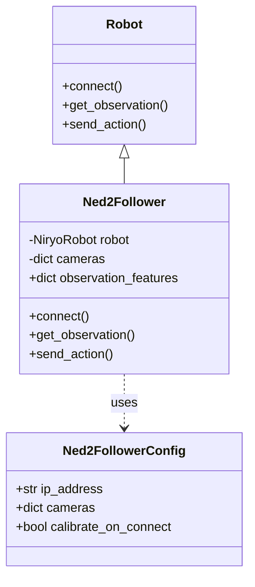

# 🤖 Niryo Ned2 Integration for LeRobot

[](https://niryo.com/product/ned2/)
[](https://github.com/huggingface/lerobot)
[](https://shop.luxonis.com/products/oak-d)
[](https://www.python.org/)

> **A comprehensive integration enabling Imitation Learning and Data Collection on the Niryo Ned2 6-axis robotic arm using the LeRobot ecosystem.**

---

## 📋 Table of Contents
- [Overview](#overview)
- [Hardware Setup](#hardware-setup)
- [Software Requirements](#software-requirements)
- [System Architecture](#system-architecture)
- [Getting Started](#getting-started)
- [File Structure](#file-structure)
- [Troubleshooting](#troubleshooting)
- [Author](#author)

---

## 🎯 Overview

This project extends the **Hugging Face LeRobot** library to support the **Niryo Ned2**, a collaborative 6-axis robot driven by a Raspberry Pi 4. By combining the robot's high-level Python API (`pyniryo`) with LeRobot's robust data collection pipeline, users can now:

1.  **Record Datasets:** Capture synchronized joint states and visual observations (OAK-D).
2.  **Train Policies:** Use captured data to train state-of-the-art imitation learning models.
3.  **Deploy:** Execute trained policies directly on the Ned2 hardware.

---

## 🔌 Hardware Setup

### Required Components
1.  **Niryo Ned2 Robot Arm**
    *   Firmware: v4.1+ (Recommended)
    *   Connection: Ethernet (Preferred) or Wi-Fi (5GHz)
2.  **Luxonis OAK-D Camera** (Optional but Recommended)
    *   Connection: USB 3.0 to the Host Computer (not the Robot directly, for lower latency)
3.  **Host Computer**
    *   OS: Linux / Windows / macOS
    *   Python: 3.10+

### Connectivity Diagram
```mermaid
graph LR
    subgraph "Host Computer (LeRobot)"
        A[Python Script] <-->|USB 3.0| B(OAK-D Camera)
        A <-->|TCP/IP (Ethernet/Verified)| C(Niryo Ned2)
    end
    
    subgraph "Niryo Ned2"
        C1[Raspberry Pi 4] --> C2[Motors]
    end
```

---

## 💻 Software Requirements

Ensure you have the core dependencies installed in your LeRobot environment.

```bash
# Core LeRobot dependencies
pip install -e .

# Ned2 & Camera specific libraries
pip install pyniryo depthai opencv-python
```

---

## 🏗️ System Architecture

The integration is built around the `Ned2Follower` class, which serves as the bridge between LeRobot's abstract `Robot` class and the specific hardware drivers.

### Class Structure


### Data Flow
1.  **Initialization:** `make_robot_from_config` reads `ned2_record_config.yaml`.
2.  **Connection:** Establishes TCP link to Ned2 (`192.168.x.x`) and initializes OAK-D pipeline.
3.  **Loop (30-60 Hz):**
    *   **Read:** Fetches Joint Positions (j1-j6) + Camera Frames (RGB/Depth).
    *   **Record:** Saves to LeRobot Dataset format (HDF5/Parquet).
    *   **Action:** Sends next target joint positions (if replaying/teleoperating).

---

## 🚀 Getting Started

### 1. Verification
Before running complex tasks, verify your hardware connection using the provided test scripts.

**Test Robot Connection:**
```bash
python test_ned2_connection.py
# Expected Output: "Successfully connected to Ned2..."
```

**Test Camera Feeds:**
```bash
python test_oakd.py
# Should open a window showing the live camera stream. Press 'q' to exit.
```

### 2. Full System Check
Run the integrated test to ensure robot and camera work together.
```bash
python test_ned2_with_camera.py
```

### 3. Recording a Dataset
To record a task (e.g., "Pick and Place"):

1.  Edit `ned2_record_config.yaml` to set your robot's IP and task name.
2.  Run the recording script (example usage):
    ```bash
    python lerobot/scripts/control_robot.py \
      --robot-path lerobot/robots/ned2_follower \
      --config-path ned2_record_config.yaml \
      --repo-id "shuaibu/ned2_pick_place"
    ```

---

## 📂 File Structure

### Configuration
*   `ned2_record_config.yaml`: Master config file. Defines robot IP, camera settings, and recording parameters (fps, episode length).
*   `ned2_specs.txt`: Detailed kinematic limits and specs for the Ned2 (used for safety checks).

### Source Code (`lerobot/robots/ned2_follower/`)
*   `ned2_follower.py`: **Core logic.** Implements the `Robot` abstract base class. Handles the translation of `pyniryo` commands to LeRobot actions.
*   `config_ned2_follower.py`: Pydantic models for type-safe configuration.

### Tests (`/`)
*   `test_ned2.py`: Simple joint movement connection test.
*   `test_oakd.py`: Standalone camera viewer for alignment.
*   `test_ned2_with_camera.py`: The "Hello World" of this integration. Connects to everything and prints one loop of observations.

---

## 🔧 Troubleshooting

| Issue | Possible Cause | Solution |
| :--- | :--- | :--- |
| **ConnectionRefusedError** | Wrong IP Address | Check `ned2_record_config.yaml`. Verify you can `ping` the robot. |
| **RuntimeError: No cameras available** | USB Issue | Unplug and replug the OAK-D. Ensure use of USB 3.0 cable. |
| **Robot moves jerkily** | Network Latency | Use Ethernet instead of Wi-Fi. Ned2 internal Pi can struggle with high-bandwidth Wi-Fi. |
| **Calibration Fail** | Obstruction | Ensure the robot has clear space to home its motors on startup. |

---

## 👨‍💻 Author

**Oluwatunmise Shuaibu**
*   **Institution:** Middlesex University London
*   **Role:** Lead Integrator

_Special thanks to the LeRobot open-source community for the foundational framework._